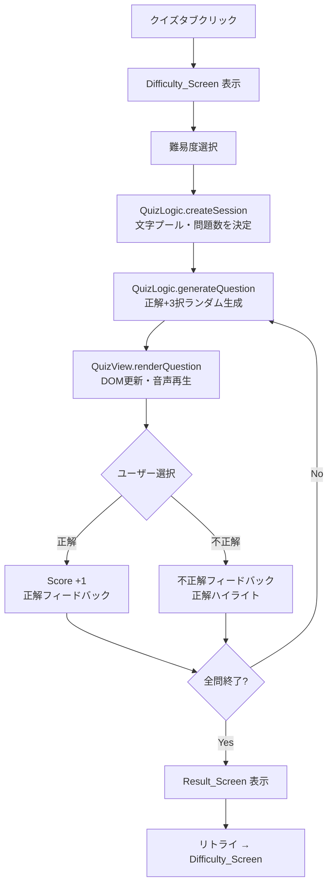

# 技術設計書：ひらがな れんしゅう

## Overview

「ひらがな れんしゅう」は、未就学児（3〜6歳）が保護者の見守りのもとでひらがな46文字を習得できるブラウザベースのWebアプリです。

**技術方針：**
- 純粋な HTML / CSS / JavaScript のみ（外部フレームワーク・ビルドステップ不要）
- サーバーサイド処理なし。`file://` プロトコルおよび静的ホスティング（GitHub Pages等）で動作
- Web Speech API による日本語音声読み上げ
- タブレット・スマートフォン・PC 対応のレスポンシブデザイン

**アプリ構成：**
- `index.html` — シングルページアプリのエントリポイント。DOM 構造・ARIA ロール定義
- `style.css` — レスポンシブレイアウト・アニメーション・ダークモード等のスタイル
- `hiragana.js` — ひらがなデータ定義・五十音表ビュー・SpeechSynthesizer モジュール
- `quiz.js` — クイズビュー・出題ロジック・スコア管理

---

## Architecture

### モジュール構成

```
index.html
 ├─ <link rel="stylesheet" href="style.css">
 ├─ <script src="hiragana.js">
 │     ├─ HIRAGANA_DATA  (定数: 五十音データ)
 │     ├─ SpeechSynthesizer  (モジュール)
 │     └─ GojuonTableView  (モジュール)
 └─ <script src="quiz.js">
       ├─ QuizLogic  (純粋関数モジュール)
       └─ QuizView   (UIモジュール)
```

### 状態管理

グローバル状態はモジュールスコープの変数で管理する（ES6 モジュール構文は `file://` での CORS 制約を避けるため非使用。即時実行関数 IIFE でスコープを分離）。

```
AppState
 ├─ activeTab: 'gojuon' | 'quiz'
 └─ quiz
      ├─ phase: 'difficulty' | 'playing' | 'result'
      ├─ difficulty: 'easy' | 'normal' | 'hard' | null
      ├─ session: QuizSession | null
      └─ interactionLocked: boolean
```

### データフロー（クイズ）



---

## Components and Interfaces

### SpeechSynthesizer モジュール

`hiragana.js` 内に定義。Web Speech API をラップし、日本語音声を非同期で初期化する。

```javascript
// インターフェース（概念）
SpeechSynthesizer = {
  // 初期化: voiceschanged イベントで日本語ボイスを取得
  init(): void,

  // テキストを読み上げる（進行中の発話はキャンセル）
  speak(text: string): void,

  // 内部状態
  _jaVoice: SpeechSynthesisVoice | null,
  _synth: window.speechSynthesis
}
```

**ボイス選択ロジック：**
1. `speechSynthesis.getVoices()` を呼び出し
2. `voice.lang` が `'ja'` で始まるボイスを最初に選択
3. 見つからない場合は `_jaVoice = null`（ブラウザデフォルト）
4. Chrome 等では `voiceschanged` イベント発火前に `getVoices()` が空を返すため、`onvoiceschanged` コールバックで再試行する

```javascript
// 実装例
function loadVoice() {
  const voices = speechSynthesis.getVoices();
  _jaVoice = voices.find(v => v.lang.startsWith('ja')) ?? null;
}
speechSynthesis.onvoiceschanged = loadVoice;
loadVoice(); // 同期的に取得できる Safari 向け
```

---

### GojuonTableView モジュール

五十音表のレンダリングと操作を担当。

```javascript
GojuonTableView = {
  // DOM 構築: HIRAGANA_DATA から Hiragana_Card を生成
  render(container: HTMLElement): void,

  // カードクリックハンドラ
  _onCardClick(char: string): void
}
```

---

### QuizLogic モジュール（純粋関数）

副作用なしの純粋関数として実装。テスト容易性を確保する。

```javascript
QuizLogic = {
  // 難易度設定を返す
  getDifficultyConfig(difficulty: 'easy'|'normal'|'hard'): DifficultyConfig,

  // Quiz_Session を作成（文字選択は疑似ランダム）
  createSession(difficulty: 'easy'|'normal'|'hard', rng?: ()=>number): QuizSession,

  // 1問を生成（正解＋3択）
  generateQuestion(
    correctChar: string,
    allChars: string[],
    rng?: ()=>number
  ): Question,

  // 回答を評価
  evaluateAnswer(question: Question, selectedChar: string): AnswerResult,

  // スコアから評価ティアを計算
  calcResultTier(correct: number, total: number): 'perfect' | 'good' | 'try-again'
}
```

---

### QuizView モジュール

DOM 操作・イベントバインディングを担当。

```javascript
QuizView = {
  showDifficultyScreen(): void,
  renderQuestion(question: Question, index: number, total: number, score: Score): void,
  showFeedback(result: AnswerResult): void,
  showResultScreen(session: QuizSession): void,
  updateProgressBar(answered: number, total: number): void
}
```

---

## Data Models

### HIRAGANA_DATA（定数）

46文字と行・段情報を格納する配列。

```javascript
/**
 * 五十音データの1エントリ
 * @typedef {Object} HiraganaEntry
 * @property {string} char    - ひらがな1文字 (例: 'あ')
 * @property {string} row     - 行名 (例: 'あ行')
 * @property {number} rowIdx  - 列インデックス 0〜10
 * @property {string} vowel   - 段名 (例: 'あ')
 * @property {number} vowelIdx - 行インデックス 0〜4 (ya行等の空セルは null)
 */
const HIRAGANA_DATA = [
  { char: 'あ', row: 'あ行', rowIdx: 0, vowel: 'あ', vowelIdx: 0 },
  { char: 'い', row: 'あ行', rowIdx: 0, vowel: 'い', vowelIdx: 1 },
  // ... 46エントリ
  { char: 'ん', row: 'わ行', rowIdx: 10, vowel: null, vowelIdx: null }
];

// 全46文字の配列（クイズ用）
const ALL_CHARS = HIRAGANA_DATA.map(e => e.char);
```

**五十音表のグリッド構造：**

| （段↓ / 行→） | あ行 | か行 | さ行 | た行 | な行 | は行 | ま行 | や行 | ら行 | わ行・ん |
|---|---|---|---|---|---|---|---|---|---|---|
| **あ** | あ | か | さ | た | な | は | ま | や | ら | わ |
| **い** | い | き | し | ち | に | ひ | み | ー | り | ー |
| **う** | う | く | す | つ | ぬ | ふ | む | ゆ | る | ー |
| **え** | え | け | せ | て | ね | へ | め | ー | れ | ー |
| **お** | お | こ | そ | と | の | ほ | も | よ | ろ | を |
|  |  |  |  |  |  |  |  |  |  | ん |

---

### DifficultyConfig

```javascript
/**
 * @typedef {Object} DifficultyConfig
 * @property {'easy'|'normal'|'hard'} id
 * @property {string} label         - 表示名 ('かんたん' 等)
 * @property {string} description   - 説明文 (問題数・範囲)
 * @property {string[]} charPool    - 出題対象文字の配列
 * @property {number} questionCount - 出題数
 */

const DIFFICULTY_CONFIG = {
  easy:   { id:'easy',   label:'かんたん',   description:'あ行〜な行・10もん', charPool: /* あ行〜な行 25文字 */, questionCount: 10 },
  normal: { id:'normal', label:'ふつう',     description:'ぜんぶ・15もん',     charPool: ALL_CHARS,             questionCount: 15 },
  hard:   { id:'hard',   label:'むずかしい', description:'ぜんぶ・20もん',     charPool: ALL_CHARS,             questionCount: 20 }
};
```

---

### QuizSession

```javascript
/**
 * @typedef {Object} QuizSession
 * @property {'easy'|'normal'|'hard'} difficulty
 * @property {string[]} selectedChars  - ランダムに選ばれた出題文字（重複なし）
 * @property {Question[]} questions    - 生成済み問題配列
 * @property {number} currentIndex     - 現在の問題インデックス (0-based)
 * @property {number} score            - 現時点の正解数
 */
```

---

### Question

```javascript
/**
 * @typedef {Object} Question
 * @property {string}   correctChar   - 正解のひらがな
 * @property {string[]} choices       - 4択の文字配列（順序はランダム）
 */
```

---

### AnswerResult

```javascript
/**
 * @typedef {Object} AnswerResult
 * @property {boolean} isCorrect     - 正解かどうか
 * @property {string}  correctChar   - 正解の文字
 * @property {string}  selectedChar  - 選択された文字
 */
```

---

## Correctness Properties

*A property is a characteristic or behavior that should hold true across all valid executions of a system — essentially, a formal statement about what the system should do. Properties serve as the bridge between human-readable specifications and machine-verifiable correctness guarantees.*

---

### Property 1: カード操作が正しい文字で音声を起動する

*For any* ひらがな文字 `c` に対応する Hiragana_Card に対して、そのカードをクリックすると SpeechSynthesizer は文字 `c` を引数として呼び出される。

**Validates: Requirements 1.6**

---

### Property 2: 音声が重複しないようキャンセルしてから発話する

*For any* 発話 A が進行中に発話 B が要求された場合、SpeechSynthesizer は B の `speak()` を呼ぶ前に必ず `cancel()` を呼び出す。

**Validates: Requirements 1.8**

---

### Property 3: すべての発話に日本語ロケールが設定される

*For any* テキスト文字列を SpeechSynthesizer に渡した場合、生成される `SpeechSynthesisUtterance` の `lang` プロパティは `'ja-JP'` でなければならない。

**Validates: Requirements 2.1**

---

### Property 4: 日本語ボイスが存在する場合は日本語ボイスを選択する

*For any* ボイスリスト（`SpeechSynthesisVoice[]`）において、少なくとも1つ以上 `lang` が `'ja'` で始まるボイスが含まれている場合、SpeechSynthesizer が選択するボイスの `lang` は `'ja'` で始まらなければならない。

**Validates: Requirements 2.4**

---

### Property 5: タブ選択で aria-selected が排他的に設定される

*For any* タブボタン `t` がアクティブになった場合、`t` の `aria-selected` は `"true"` であり、他のすべてのタブボタンの `aria-selected` は `"false"` でなければならない。

**Validates: Requirements 3.5**

---

### Property 6: クイズセッションで出題文字に重複がない

*For any* 難易度設定を用いて `QuizLogic.createSession()` を実行した場合、生成された `QuizSession.selectedChars` の配列にはいかなる重複も存在してはならない。

**Validates: Requirements 5.1**

---

### Property 7: 生成された問題が構造的に正当である

*For any* 正解文字 `c` と全文字リスト `chars` を使って `QuizLogic.generateQuestion(c, chars)` を呼び出した場合、生成された `Question` は以下をすべて満たさなければならない：
- `choices` の長さがちょうど4である
- `choices` に `c` が含まれる
- `choices` の中に重複がない
- `c` 以外の3択はすべて `c` と異なる

**Validates: Requirements 5.2, 5.3, 5.4, 5.5**

---

### Property 8: スコアが正解回数に正確に対応する

*For any* 問題への回答シーケンスに対して、`QuizSession.score` の値はそのシーケンス中の正解回数にちょうど等しくなければならない。

**Validates: Requirements 5.8**

---

### Property 9: 不正解フィードバックに正解文字が含まれる

*For any* 間違った選択肢 `w`（`w ≠ correctChar`）が選ばれた場合、表示されるフィードバックメッセージ文字列には `correctChar` が含まれていなければならない。

**Validates: Requirements 6.2**

---

### Property 10: 選択後に正解ボタンがハイライトされ全ボタンが無効化される

*For any* Choice_Button のクリック（正解・不正解問わず）後、以下が成り立たなければならない：
- 正解の Choice_Button は正解スタイルのクラスを持つ
- 4つすべての Choice_Button が `disabled` 状態である

**Validates: Requirements 6.3, 6.5**

---

### Property 11: 進捗表示値が実際のセッション状態と一致する

*For any* クイズ進行状態（回答済み問題数 `n`、総問題数 `total`、正解数 `score`）において、DOM に表示される問題番号・スコア・Progress_Bar の `aria-valuenow` はそれぞれ実際の値と一致しなければならない。

**Validates: Requirements 7.1, 7.2, 7.3**

---

### Property 12: 結果画面のスコア表示が実際の値と一致する

*For any* 完了した `QuizSession` において、Result_Screen に表示される「正解数 / 総問題数」の比は実際のセッション結果と等しくなければならない。

**Validates: Requirements 8.2**

---

### Property 13: スコア評価関数が正しいティアを返す

*For any* 正解数 `c` と総問題数 `t`（`0 ≤ c ≤ t`、`t > 0`）において：
- `c / t === 1.0` のとき、`calcResultTier` は `'perfect'` を返す
- `0.7 ≤ c / t < 1.0` のとき、`calcResultTier` は `'good'` を返す
- `c / t < 0.7` のとき、`calcResultTier` は `'try-again'` を返す

**Validates: Requirements 8.3, 8.4, 8.5**

---

### Property 14: 1問につき最初のクリックのみ処理される（連打防止）

*For any* 問題に対するクリックイベントのシーケンスにおいて、最初のクリックの後にいくつのクリックが続いても、`QuizSession.score` と `interactionLocked` の状態は最初のクリックの結果のみを反映し、以降のクリックは無視されなければならない。

**Validates: Requirements 9.1, 9.2**

---

### Property 15: 新しい問題表示時にインタラクション状態がリセットされる

*For any* 新しい Question が表示された直後、`interactionLocked` は `false` であり、4つの Choice_Button はすべて有効（`disabled` でない）でなければならない。

**Validates: Requirements 9.3**

---

## Error Handling

### Web Speech API 非対応ブラウザ

```javascript
// 起動時チェック
if (!('speechSynthesis' in window)) {
  // サイレントフォールバック: 音声なしで動作継続
  // UI上の音声ボタン等はそのまま存在するが何もしない
  console.warn('Web Speech API is not supported. Audio features disabled.');
}
```

音声機能はアプリの動作に必須ではないため、非対応時はサイレントフォールバックとする。

---

### ボイスリスト取得失敗

- `getVoices()` が空配列を返した場合 → `_jaVoice = null` のままブラウザデフォルトで再生
- `voiceschanged` イベントが発火しないブラウザへの対策として、`setTimeout` によるフォールバック再試行を実装する

```javascript
let voiceRetries = 0;
function loadVoice() {
  const voices = speechSynthesis.getVoices();
  if (voices.length === 0 && voiceRetries < 5) {
    voiceRetries++;
    setTimeout(loadVoice, 200);
    return;
  }
  _jaVoice = voices.find(v => v.lang.startsWith('ja')) ?? null;
}
```

---

### クイズ出題でのランダム選択エッジケース

- 「かんたん」モードの文字プール（25文字）から10問選ぶ際は、プールサイズ > 問題数を確保済み
- 3択ディストラクター生成時に全46文字から選ぶため、正解文字との衝突チェックをループで実施
- 最大試行回数（100回）を超えた場合は例外をスローし、`QuizView` でリカバリ（セッション再生成）

---

### 連打・二重クリック

- `interactionLocked` フラグで最初のクリック後に即座にロック
- `pointer-events: none` を CSS で組み合わせて DOM レベルでも無効化
- `setTimeout` コールバック内で次問に遷移する前にロック解除しない

---

## Testing Strategy

### テストアプローチ

このアプリは外部フレームワークを使用しないため、テストも軽量なバニラ JS + プロパティベーステストライブラリで構成する。

**採用ライブラリ：**
- プロパティベーステスト：[**fast-check**](https://fast-check.dev/)（ブラウザおよび Node.js 対応、CDN 経由で使用可能）
- ユニットテスト：ブラウザ標準の `console.assert` ベースの軽量テストランナー、または **Vitest**

---

### ユニットテスト（具体例・エッジケース）

ユニットテストは `QuizLogic` の純粋関数を対象とした具体的なシナリオをカバーする。

| テスト対象 | 内容 |
|---|---|
| `HIRAGANA_DATA` | 46エントリ存在すること・各エントリの構造が正しいこと |
| `getDifficultyConfig` | 各難易度の `charPool` サイズと `questionCount` が仕様通りであること |
| `createSession` | 「かんたん」モードが あ行〜な行のみを使用すること |
| `generateQuestion` | 正解が必ず選択肢に含まれること（具体例） |
| `evaluateAnswer` | 正解・不正解の両ケースで `AnswerResult` が正しいこと |
| `calcResultTier` | 境界値（100%、70%、69%）での返り値が正しいこと |
| `SpeechSynthesizer.speak` | キャンセルが先行すること（モック使用）|
| Tab ナビゲーション | クリック後に正しいビューが表示されること |
| Difficulty_Screen | クイズタブ選択時に先に表示されること |

---

### プロパティベーステスト（Property-Based Tests）

fast-check を使用し、各プロパティを最低100イテレーションで検証する。

| プロパティ | 対象関数 | fast-check アービトラリ |
|---|---|---|
| Property 6: 出題文字の重複なし | `createSession` | `fc.constantFrom('easy', 'normal', 'hard')` |
| Property 7: Question 構造の正当性 | `generateQuestion` | `fc.constantFrom(...ALL_CHARS)` for correctChar |
| Property 8: スコアの正確性 | `evaluateAnswer` + score 集計 | `fc.array(fc.boolean())` for correct/wrong sequence |
| Property 13: スコア評価ティア | `calcResultTier` | `fc.integer({min:0, max:total})` for correct count |
| Property 14: 連打防止 | `QuizView` + interaction lock | `fc.array(fc.nat(), {minLength:2})` for click sequence |

```javascript
// Property 7 の実装例
import fc from 'fast-check';

fc.assert(
  fc.property(
    fc.constantFrom(...ALL_CHARS),
    (correctChar) => {
      const q = QuizLogic.generateQuestion(correctChar, ALL_CHARS);
      const unique = new Set(q.choices);
      return (
        q.choices.length === 4 &&
        q.choices.includes(correctChar) &&
        unique.size === 4
      );
    }
  ),
  { numRuns: 100 }
  // Feature: hiragana-learning-app, Property 7: 生成された問題が構造的に正当である
);
```

**タグ形式：** 各プロパティテストには以下の形式でコメントを付与する  
`// Feature: hiragana-learning-app, Property {N}: {property_text}`

---

### スモークテスト / 手動テスト

以下は自動化が難しいため手動またはチェックリストで確認する。

| 確認内容 | 方法 |
|---|---|
| `file://` プロトコルで全機能動作 | 手動 |
| iOS Safari / Android Chrome での double-tap zoom 防止 | デバイス実機テスト |
| 日本語ボイスの音声品質 | 実機確認（Chrome / Safari / Firefox）|
| 320px 幅での横スクロールなし | Chrome DevTools レスポンシブモード |
| `prefers-reduced-motion` 時のアニメーション抑制 | OS設定でアニメーション無効化して確認 |
| 外部依存のインポートがないこと | ソースファイルの静的解析 |
| ARIA 属性の正確性 | axe DevTools 等のアクセシビリティ検査ツール |
